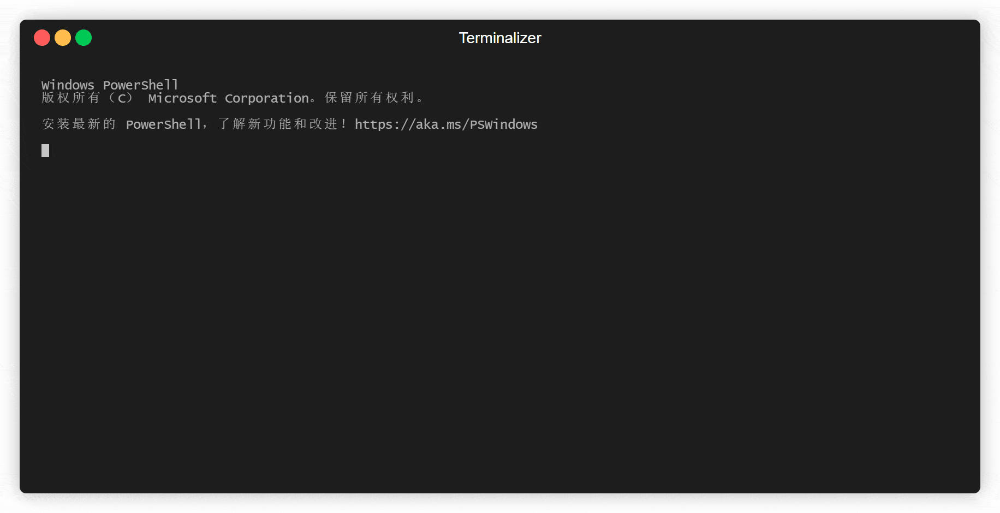

# 局域网文件分享工具（Local Network File Sharing Tool）

欢迎使用局域网文件分享工具！这是一个基于 Rust 编写的终端应用，专为局域网内快速分享文件而设计。

## 主要功能

- **局域网分享：** 在局域网内通过 QR 码或 URL 连接分享文件。
- **电脑到手机拷贝：** 方便地将电脑上的文件拷贝到手机或其他设备。
- **用户友好：** 直接扫描二维码即可完成文件传输，无需复杂的操作。

## 如何使用

1. **克隆项目到本地：**

   ```bash
   git clone https://github.com/Zander-1024/axum-fshare.git
   ```

2. **编译项目：**

   ```bash
   cd axum-fshare
   cargo build --release
   ```

3. **运行应用：**

   ```bash
   axum-fshare FILE_PATH
   ```

   

   图片使用 `terminalizer`生成

4. **分享文件：**

   应用将会生成一个局域网 IP 地址的 QR 码和 URL 连接，你可以将其分享给其他设备，让它们可以访问你的文件。

## 使用的依赖库

- **qrrs：** 生成 QR 码的 Rust 库。感谢 [Lenivaya](https://github.com/Lenivaya/qrrs) 的贡献！

## TODO

- [ ] 开发 GUI 版本的应用，提供更加友好的用户界面。
- [ ] 支持传输文件夹。

## 技术栈

- **Rust：** 主要编程语言。
- **Networking：** 局域网内的网络通信。
- **Terminal UI (TUI)：** 终端用户界面。

## 贡献

如果你对该项目感兴趣，欢迎提交 issue 或 pull request，让我们一起改进和完善这个工具！

## 许可证

该项目采用 MIT 许可证进行许可，详情请参阅 [LICENSE](LICENSE) 文件。

感谢您使用局域网文件分享工具！如果您有任何问题或建议，请随时联系我们。
